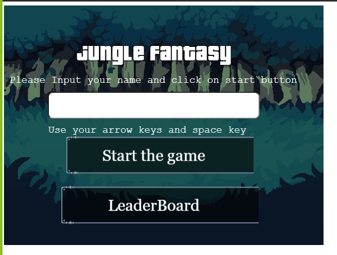

# Jungle Fantasy

> You need to kill all the monster that suddenly appeared in the village and try to kill as much to save the village

This is a RPG Game where you need to kill the monster that suddenly appeared in the village and you are one of the saviour of the village and the village depends on you. Be Careful... Getting touched by them will take your soul of your body.

## Built With

- Javascript ES6
- Phaser3
- Webpack
- Babel
- Jest

## Live Demo

[Jungle Fantasy](https://jungle-fantasy.netlify.app/)

## About the Game

### Mechanics

The player start at the entrance of the particular village which is taken by the zombies and it has the ability to move up,left,right, down and shoot with your superpower .You need to collect the coins that are in the middle of the village and that will be your reward for saving the village.

As the game start the zombies become randomized and each one has different bar of health which is being randomized to make the game intersting and they are appearing randomly on the screen with the motion in random direction.

When the player clicks the space bar the special power follows a straight path toward the direction of your motion. It it hits a monster,the energy gets destroyed and monster loses some part of their health

If the player touched by a zombie he loses one life and will die if he loses 3 health and on the road he collect the money as he want.The appearance of these monster can't be controlled,They will appeared anywhere on the path and try to attack you

The player has 3 lives that are subtracted by 1 each time he is touched by a zombie. When it reaches 0, GAME OVER.

### Scenes

- Boot - Preload the assets and starts the "Title" scene.
- Title - Shows the game logo, gets the player name and has the buttons to click "Start Game", and "LeaderBoard" with instructions.
- Game - The game itself. It has only two levels and shows score and lives, besides player and zombies.although you can switch betwween the levels.
- GameOver - Shows player's score with "Play Again" and "LeaderBoard" button which can be used by click on them.
- LeaderBoard- Show the top 5 scorelist of the player

### Development Steps

- Think about the game mechanices
- Find assets (Backgrounds, Character Sprites, Buttons, etc)
- Setup the development environment with Phaser
- Load assets in the project
- Think about the score system
- Create the title system and game scene with the logic and the physics of the player
- Create the gamover scene

- Connect the score system with the API
- Create the leadboard and connect it with the API

## Getting Started

### Setup & Run

- Clone this repository with: `git clone https://github.com/shubhsk88/jungle-fantasy.git`
- Navigate to the project folder `cd jungle-fantasy`
- Run `npm install`
- Run `npm start`. It will build the project and automatically open your browser in the game page.
- Have fun!
- (Optional) Run `npm run build` to create the `build` folder for deployment.

### Tests

- Run `npm test`

## Potential Features

- LeaderBoard button in TitleScene
- Unlimited Enemies and coins
- Switching Scene between the different part of the village

## 👤 Author

👤 **Shubham Singh**

- Github: [@shubhsk88](https://github.com/shubhsk88)
- Twitter: [@shubhski](twitter.com/shubski)
- Linkedin: [linkedin](https://www.linkedin.com/in/shubhski/)

## 🤝 Contributing

Contributions, issues and feature requests are welcome!

Feel free to check the [issues page](https://github.com/shubhsk88/jungle-fantasy/issues).

## Show your support

Give a ⭐️ if you like this project!

## Acknowledgments

- Button assets by [Open Game Art](https://opengameart.org/)

## 📝 License

This project is [MIT](LICENSE) licensed.
